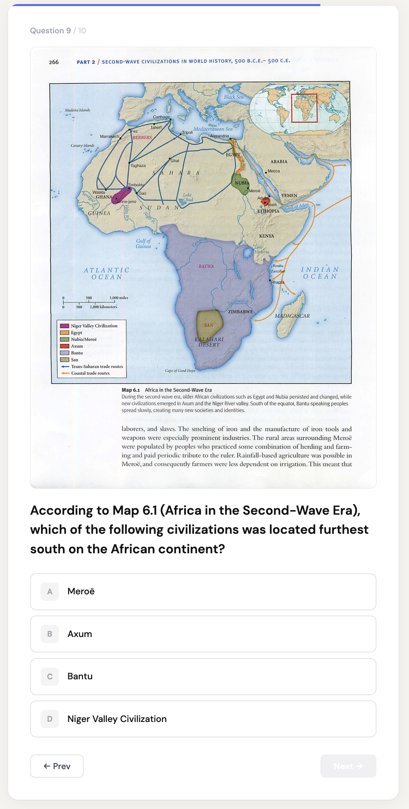
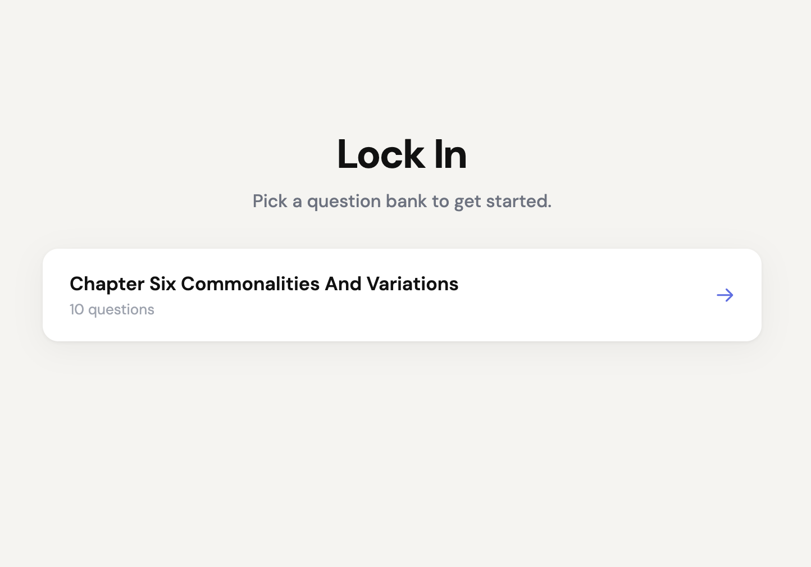
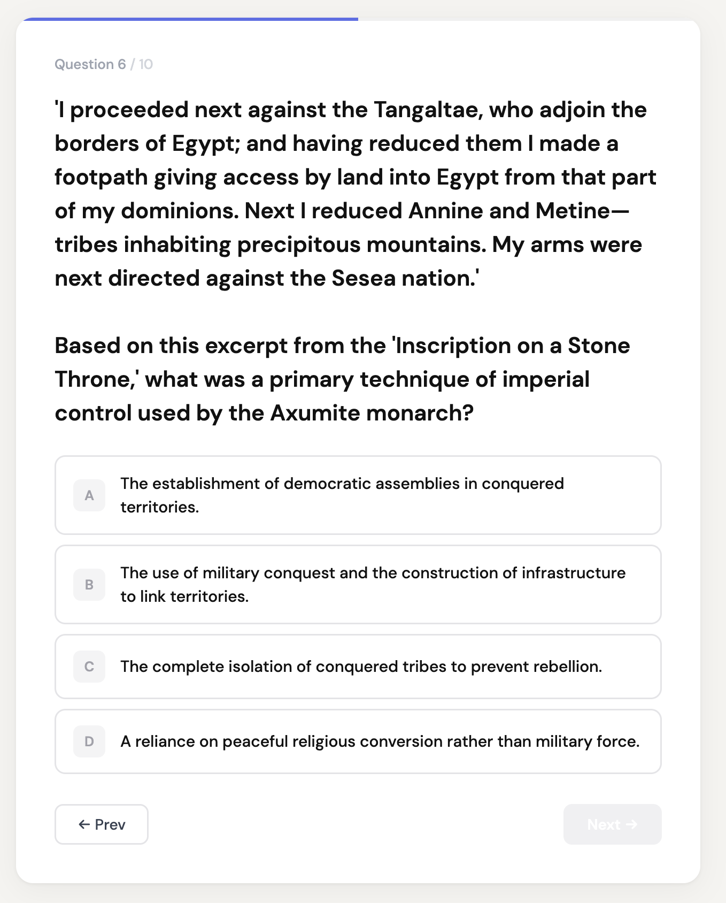
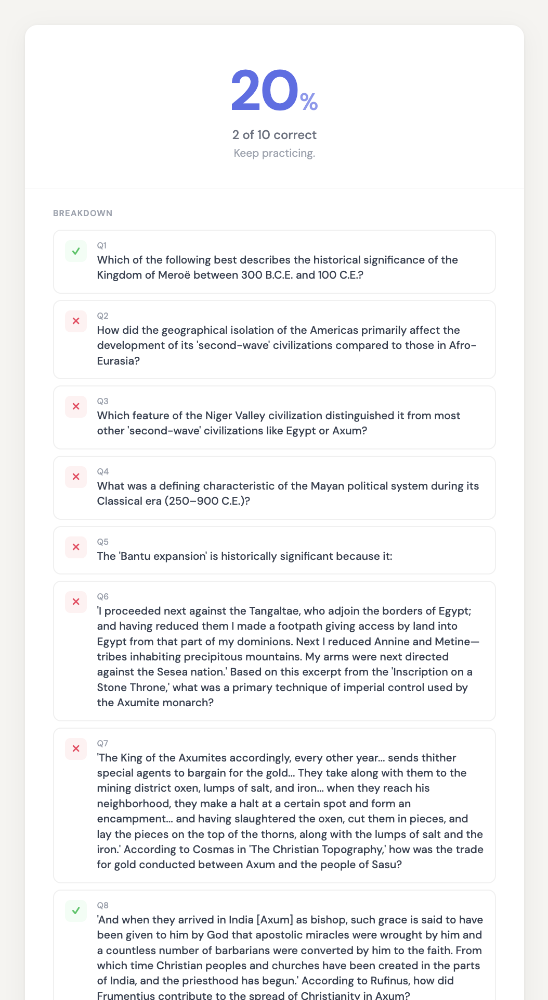
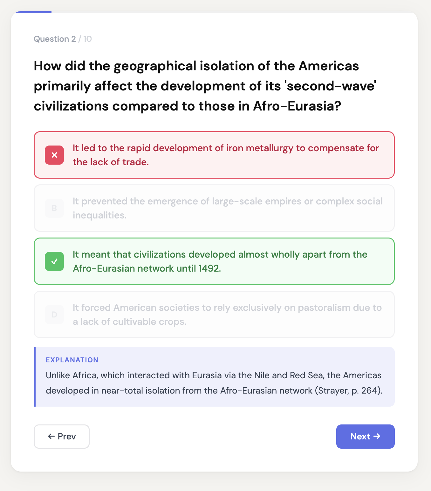
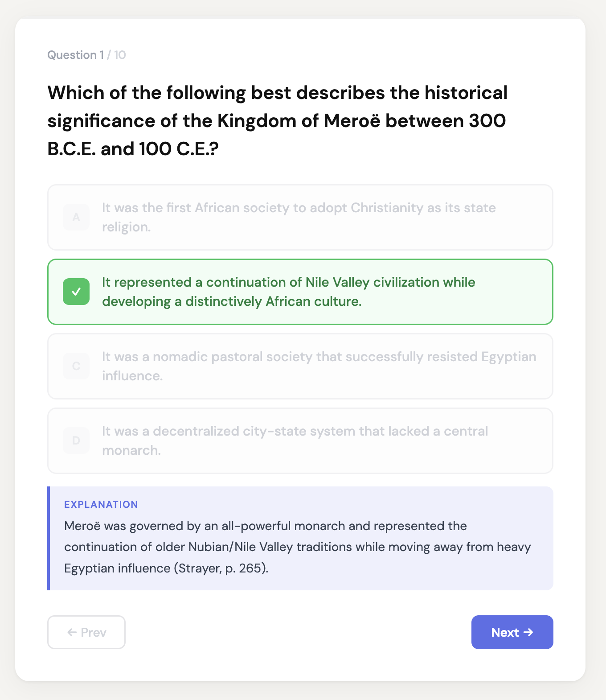

# Lock In

A minimal, high-rigor multiple-choice quiz interface. One question at a time, immediate feedback, and results breakdown. Designed for students who need to "lock in" on complex historical or technical material.



**Live:** [https://gfxblit.github.io/lockin/](https://gfxblit.github.io/lockin/)

## The Experience

Lock In is designed to minimize distraction while maximizing recall.

| Start Screen | Visual Questions | Feedback & Results |
| :--- | :--- | :--- |
|  |  |  |

- **Immediate Feedback**: Know exactly why you missed a question with inline pedagogical explanations.

  | Correct State | Incorrect State |
  | :--- | :--- |
  |  |  |

- **Visual Evidence**: Support for Type C questions using embedded maps, charts, and artifacts.
- **Clear Progression**: Track your score and see a full breakdown at the end.

## Features

- **Automatic Discovery**: Drop a `.jsonl` file into `src/banks/` and it appears on the start screen automatically.
- **Immediate Feedback**: Instant correct/wrong state with optional pedagogical explanations.
- **Pedagogical Rigor**: Supports document analysis (Type B) and visual evidence (Type C) via embedded images.
- **Zero Overhead**: No router, no backend, no complex state management.
- **Mobile First**: Clean, responsive UI with a "native app" feel.

## Getting Started

### Local Development

```bash
npm install
npm run dev
```

The app runs at `http://localhost:5173/lockin/`.

### Deployment

Push to `main`. GitHub Actions builds and deploys to GitHub Pages automatically.

## Content Management

### Adding Question Banks

Question banks are stored in `src/banks/` as JSONL files. Each line is a single question object.

**Schema:**
```json
{
  "id": "q1",
  "question": "Verbatim Primary Source...\n\nActual question?",
  "options": ["Option A", "Option B", "Option C", "Option D"],
  "answer": 0,
  "explanation": "Detailed explanation citing source.",
  "image": "images/slug/img-001.png"
}
```

- `image` paths are relative to the `public/` directory.
- See [BANK-SPEC.md](./BANK-SPEC.md) for full quality standards and question types.

### Generating Banks (with AI Agents)

If you are using an AI coding agent (like Gemini CLI or Claude Code), you can use the following prompts to generate banks autonomously:

**Prompt Example (PDF Analysis):**
> Read AGENTS.md and BANK-SPEC.md. Generate 10 questions covering the topics in `source.pdf`. I want a mix: 5 Type A (Quizlet-style), 3 Type B (Document Analysis), and 2 Type C (Visual Analysis). Use `scripts/extract-images.js` to get the visuals first, then write the final JSONL to `src/banks/`.

**Prompt Example (Topic Refinement):**
> Review the existing `src/banks/strayer-ch6.jsonl`. Generate 5 more advanced questions (Difficulty: Hard) that focus on the economic impacts of the Silk Road. Ensure explanations cite page numbers from the Ch 6 PDF.

## Architecture & Stack

- **Framework**: React 18 (Vite)
- **Styling**: Vanilla CSS via inline `style` props (No Tailwind, No CSS modules)
- **Discovery**: `import.meta.glob` for build-time bank loading.
- **Routing**: State-based screen switching (Start → Question → Results).

For detailed developer notes on components and conventions, see [AGENTS.md](./AGENTS.md).

## Design

The UI is based on a custom design specification.
- **Design Tokens**: See [designs/README.md](./designs/README.md)
- **Reference Prototype**: Open [designs/lockin.html](./designs/lockin.html) in a browser.
